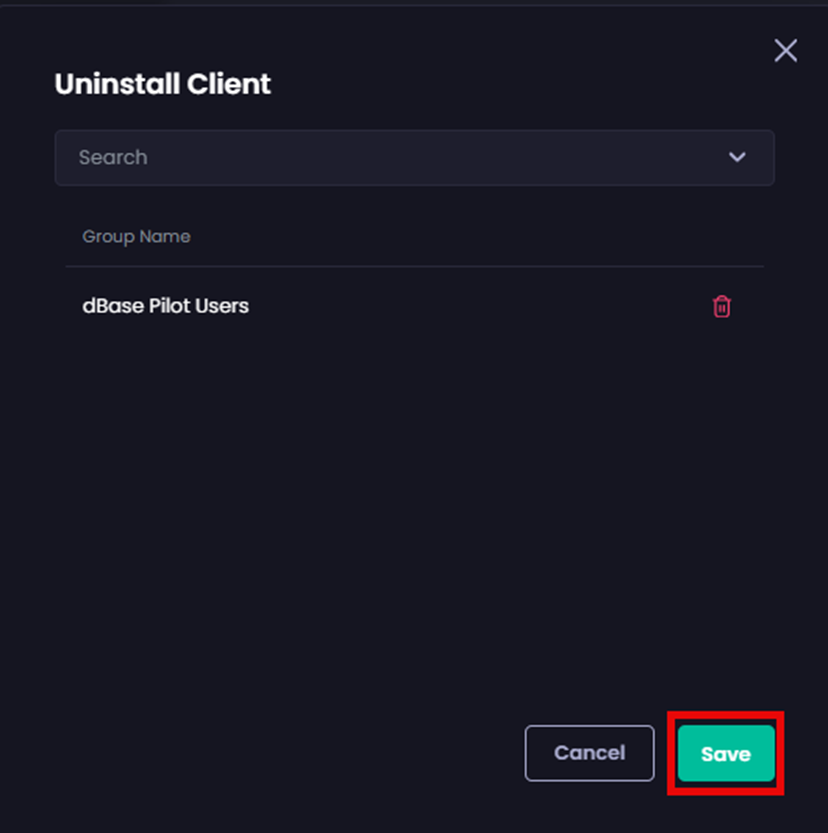

# Uninstall the Patch My PC Client

_Applies to: Patch My PC Client_

You can use the following methods to uninstall the Patch My PC (PMPC) Client:

* [Select specific Entra ID groups to uninstall the PMPC client from](uninstall.md#select-specific-entra-id-groups-to-uninstall-the-pmpc-client-from)
* [Create an Uninstall Deployment from the Intune admin center](uninstall.md#create-an-uninstall-deployment-from-the-intune-admin-center)

## Select specific Entra ID groups to uninstall the PMPC client from

To uninstall the Patch My PC (PMPC) Client you can select specific Entra ID groups to uninstall the client from.


**Important**

Deleting a device from Intune that has the PMPC Client installed will **NOT** uninstall the PMPC Client, meaning the device will still show in PMPC Reporting. The only way to uninstall the PMPC Client is to use one of the above methods.

Also, if your trial license has expired and you have installed the PMPC Client during your trial, please see the [If your Trial License has Expired](uninstall.md#if-your-trial-license-has-expired) section below.


To uninstall the PMPC Client from specific Entra ID groups:

1. Navigate to **Settings | Deploy Client**
2. Click the relevant **Uninstall Client** button.

<figure><figcaption></figcaption></figure>

3. Select the relevant group.

<figure><figcaption></figcaption></figure>


**Note**

If a group is greyed out, it means the current Client deployment is targeted to that group, and must be cleared first from the (Install) deployment before it can be selected for Uninstall.


4. Add any additional Groups as required.
5. Click **Save**.

<figure><figcaption></figcaption></figure>

The **Deploy Client** page is displayed along with the **Success – Updated** notification.

<figure><figcaption></figcaption></figure>

The Client will then be uninstalled from all the devices within the selected Entra ID Group(s).

## Create an Uninstall Deployment from the Intune admin center

You can create an uninstall deployment in the Intune admin center that has the command for uninstalling the PMPC Client configured in the **Uninstall Command** field:

```
MSIExec.exe /x PatchMyPC.ClientInstaller.msi /qn
```

<figure><figcaption></figcaption></figure>

## If Your Trial License has Expired

If your PMPC Cloud Trial License has expired, the **Your license has expired...** banner appears at the top of the Cloud Portal, and when you navigate to **Deploy Client** both the **Delete** and **Save** buttons are disabled.

If you have deployed the PMPC Client during your trial, you should click **Uninstall Client** beside the relevant Client deployment channel used to install the Client.

On the **Confirm Uninstall Action** dialog box, click **Uninstall**.

<figure><figcaption></figcaption></figure>

A new app is created in Intune for the relevant Entra ID groups with an **Uninstall** assignment to uninstall our Client.
