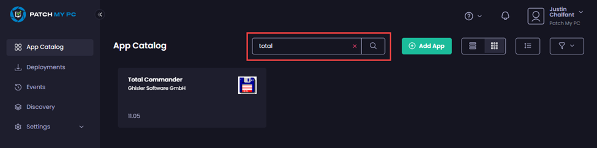

# Update a Custom App

_Applies to: Patch My PC Cloud Custom Apps_

Once you have created and deployed a Custom App, you will probably need to update it at some point to a later version.


Note

See [Modifying a Custom App](modify-a-custom-app.md) for details on how to make other changes to an existing Custom App.


To update a Custom App using Patch My PC (PMPC) Cloud:

1. Sign in to the PMPC portal [https://portal.patchmypc.com/](https://portal.patchmypc.com/).
2. On the **App Catalog** page, search for the relevant app.

<figure><figcaption></figcaption></figure>

3. Click the app to open it.
4. On the app’s properties page, click **Add Version**.

<figure><figcaption></figcaption></figure>

The Custom Apps Deployment Wizard starts and opens at the **File** page.

<figure><figcaption></figcaption></figure>


**Note**

You cannot modify the **Installer Type** of a Custom App.


5. Follow the respective section for the respective **Installer Type** of this app:
   1. [Add a new version based on a new Installer Script](update-a-custom-app.md#add-a-new-version-based-on-a-new-installer-script)
   2. [Add a new version based on a new Installer File](update-a-custom-app.md#add-a-new-version-based-on-a-new-installer-file)

## Add a new version based on a new Installer Script

To add a new version of a Custom App based on a new installer script, follow the [Add the Installation Script](create-a-custom-app/custom-apps-file-tab.md#add-the-installation-script) section of [Custom Apps "File" tab](create-a-custom-app/custom-apps-file-tab.md).

Once completed, goto Step 6.

## Add a new version based on a new Installer File

To add a new version of a Custom App based on a new installer file, on the **Add Version** page, either:

* Click **Add Primary Install File** and browse to the location containing the updated version of the app’s installer (EXE or MSI).
* Drag and drop the installer file onto this page.

<figure><figcaption></figcaption></figure>

The hash for the file is calculated as the file is uploaded to your portal.

<figure><figcaption></figcaption></figure>

Once completed, goto Step 6.

6. If the installer does not require any additional files or folders, go to Step 8.
7. If the installer does require additional files or folders, either:
   1. Click the relevant **Add** button and browse to the location containing the additional files/folders.
   2.  Drag and drop the files onto this page. 

       <figure><figcaption></figcaption></figure>


**Note**

If you choose to upload additional folders, you will be prompted to confirm you trust this site:



8. Once the files/folders have been uploaded, click **Next**.

<figure><figcaption></figcaption></figure>

9. On the **Configuration** page, enter the version number and update any other fields as required.


**Note**

If a Return Code defined in a Custom App has the same value but a different **Code type** to that defined in the deployment, the settings in the deployment take precedence.


<figure><figcaption></figcaption></figure>

10. If you are happy you have entered all of the details for the app correctly, click **Save** otherwise, click **Next**.

<figure><figcaption></figcaption></figure>

11. On the **Detection Rules** page, make any required changes.

<figure><figcaption></figcaption></figure>

12. If you are happy you have entered all of the details for the app correctly, click **Save** otherwise, click **Next**.

<figure><figcaption></figcaption></figure>

13. On the **Summary** page, review you have configured the app correctly.
    1. If you are happy, click **Create**.
    2. If you need to change something, click **< Prev** to backtrack through the Deployment Wizard to the relevant setting. Make the change, then step back through the wizard to this page. If everything is now correct, click **Create**.

<figure><figcaption></figcaption></figure>

11. The App Catalog is displayed showing the version of the app along with the following notification:\
    \
    **Success Version <**_**version\_number**_**> has been successfully added to <**_**app\_name**_**>**.

<figure> has been successfully added to <app_name>" width="563"><figcaption></figcaption></figure>

If the previous version of the app was deployed successfully, depending on the configured assignments, the new version will be installed the next time the daily sync runs.

Alternatively, you can use the [Sync Now](../deployments/manage-deployments/updates/sync-now.md) process to update the app immediately without waiting for the next daily sync to run.
