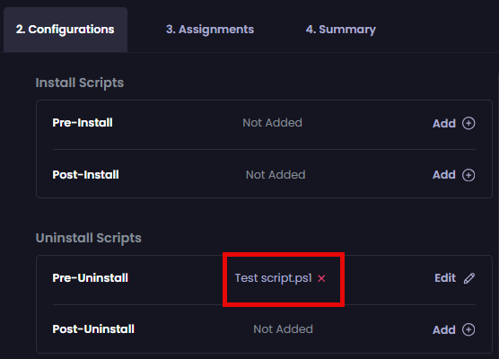

# Using Pre-Uninstall Scripts in a Patch My PC Cloud Deployment

_Applies to: Patch My PC Cloud_

A _Pre-Uninstall Script_ is a script that can be run before the uninstaller runs.

To add a Pre-Uninstall script:

1. Click **Add** beside the **Pre-Uninstall** option.

<figure><figcaption></figcaption></figure>

The **Add Pre-Install Script** page is shown, highlighting that the default **Script Format** is **.ps1**, with built-in support for PSADT functions.

2. To import an existing script, click **Import** then browse to the location containing the script and select it.

<figure><figcaption></figcaption></figure>

The **Script Name** field is populated with the filename of the script selected, and the **Add Pre-Uninstall Script** page is populated with the imported script.

<figure><figcaption></figcaption></figure>

3. To manually add a script, enter a unique name for the script in the **Script Name** field.

<figure><figcaption></figcaption></figure>

4. Select the type of script from the **Script Format** dropdown.

<figure><figcaption></figcaption></figure>

5. In the script editor, type your script.

<figure><figcaption></figcaption></figure>


**Note**

We currently have a limit of 50,000 characters per script. Use the **Number of characters used** counter to keep track of the number of characters you’ve entered in the script editor.

If PSADT commands are detected in the Script Editor, the **Script Format** field is updated to show **.ps1 +** the PSADT logo.




**Tip**

Under the script editor, we include example syntax to help you understand the required syntax for referencing any additional files you've uploaded, which updates depending on the **Script Format** selected.


6. In the **Arguments** field, enter any arguments you want to provide to the script.

<figure><figcaption></figcaption></figure>


**Tip**

You can use variable names as arguments, provided they are enclosed by percentage signs (`%`). We provide common variables under this field, which you can add by clicking the plus (`+`) symbol or relevant variable name.



**Important**

Using script Arguments is currently unsupported when deploying an app to macOS.

Also, if you add any PSADT scripts to your deployments, you need to ensure .NET version 4.7.2 is installed on any devices to which this app will be deployed.


7. Check the **Don’t attempt software uninstall if the pre script returns an exit code other than 0 or 3010** checkbox if you don’t want the app to be uninstalled if the pre-script returns an exit code other than **0** or **3010**.\
   \
   If you do not check this checkbox, we will attempt to uninstall the app regardless of the exit code returned by the pre-install script.

<figure><figcaption></figcaption></figure>

8. Check the **Run the pre-uninstall script before performing any auto-close or skip process checks** checkbox if you want to run the pre-uninstall script before the conflicting process notification is displayed (if relevant).\
   \
   If you do not check this checkbox, we will run the pre-uninstall script after the conflicting process notification.

<figure><figcaption></figcaption></figure>

9. Click **Save** to save your script.

<figure><figcaption></figcaption></figure>

The **Configurations** tab is re-displayed with the name of the configured script beside it.

<figure><figcaption></figcaption></figure>


**Tip**

You can click **Edit** to edit a script or its settings. You can also click the red “`x`” beside a script to delete it.


## Next Steps

If you do not want to configure any additional settings, click **Next** to move to the [Assignments](../../../assignments-tab.md) tab.

Otherwise, navigate to the relevant tool to configure the required settings, which are explained in the relevant section.
