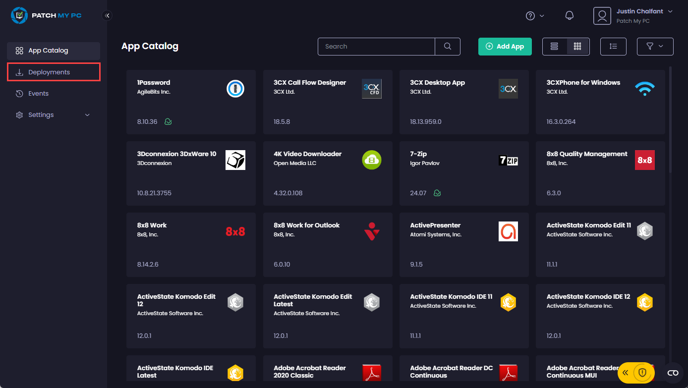

# Manage Updates to a Patch My PC Cloud Deployment

_Applies to: Patch My PC Cloud_

Once Patch My PC (PMPC) Cloud has successfully deployed an app, you need to decide how to manage any updates to that app.


**Note**

By default, every morning at 02:00 AM in the country you selected during onboarding, our [Sync Schedule](../../../manage/settings/sync-schedule.md) runs to check for any updates to apps you have successfully deployed. If a newer version is found, we:

* Create a new version of the app in your Intune tenant.
* Move the assignments for the current version over to the new version.
* Install the new version on the relevant devices.

Also, if a deployment has [App Dependencies](../../deploy-app/configurations-tab/additional-tools/dependencies.md) (either this deployment has dependencies on another deployment or another deployment has dependencies on this deployment), at the time the [Sync Schedule](../../../manage/settings/sync-schedule.md) runs, if a newer version is found, we:

* Create a new version of the app in your Intune tenant.
* Move all the dependencies for the current version over to the new version.
* Install the new version on the relevant devices.

The next time the Sync Schedule runs, that is when we delete the old version of the Intune app, which includes removing it from any Enrollment Status Page (ESP) profiles.


All update-related tasks for an app are performed at the deployment level from the **Deployments** node of the PMPC portal by:

Navigating to the **Deployments** node.

<figure><figcaption></figcaption></figure>

The **Deployments** page is then displayed, showing any existing deployments and allowing you to:

* [Pause Updates](pause.md)
* [Resume Updates](resume-updates.md)
* [Sync Now](sync-now.md)

<figure><figcaption></figcaption></figure>
