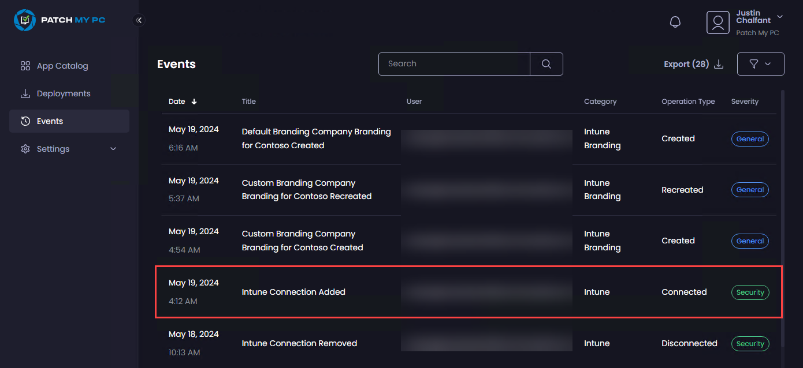
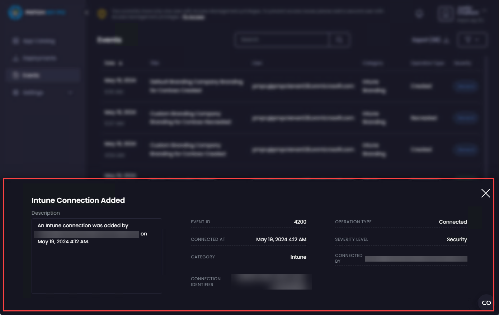

# Find Out More About an Event in Patch My PC Cloud

_Applies to: Patch My PC Cloud_

You can display more information about a Patch My PC (PMPC) Cloud Event by clicking it.

<figure><figcaption></figcaption></figure>

The details page is displayed for the Event.

<figure><figcaption></figcaption></figure>

Either click the **X** or click outside of the details page to close it.
