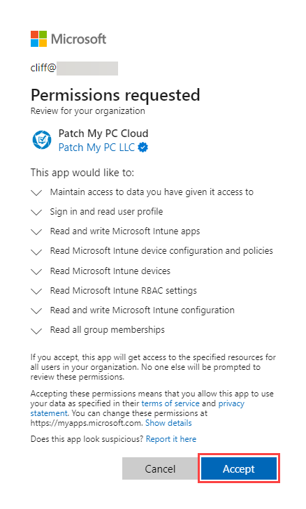
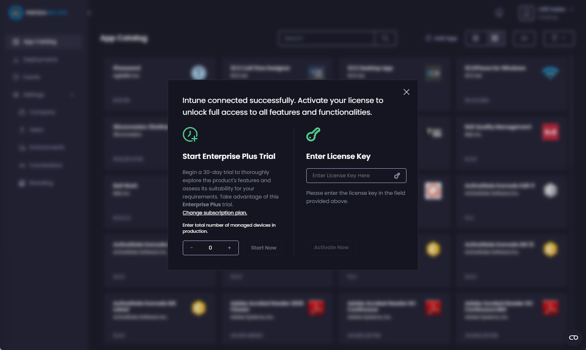

# Onboard to Intune Apps

_Applies to: Intune Apps for Cloud_


**Important**

You should have already onboarded your company to Patch My PC (PMPC) Cloud as detailed in [Onboarding to Cloud](../../onboard-cloud.md) before continuing.

If you are an existing Custom Apps user, please follow the [Onboarding to Intune Apps for Custom Apps users](onboard-to-intune-apps-for-custom-apps-users.md) process.


To onboard to the Intune Apps for Cloud (Intune Apps):

1. Sign in to the Portal at [https://portal.patchmypc.com/](https://portal.patchmypc.com/).
2.  On the **App Catalog** page, click **Connect** under **Intune**. 

    <figure><figcaption></figcaption></figure>
3.  Enter the Entra ID you used to onboard to PMPC Cloud or click to select the relevant account from the list of already signed-in accounts. Then click **Next**. 

    <figure><figcaption></figcaption></figure>
4.  Enter the password and click **Sign in**.

    <figure><figcaption></figcaption></figure>
5.  On the **Permission requested** screen, click **Accept**. 

    <figure><figcaption></figcaption></figure>


**Note**

We require these permissions to connect with your Intune tenant.

See [Permissions required for Intune Apps](../../technical-references/cloud-permissions-reference/permissions-required-for-intune-apps.md) for more details.



**Tip**

You can click the down arrow beside each permission to get more information.


6.  If you see the **Intune connected successfully** screen, continue.\
    \
    If you do not see this screen, it is probably because you already have a suitable, valid PMPC license. Continue to Step 8. 

    <figure><figcaption></figcaption></figure>
7.  On the **Intune connected successfully** screen, either:\
    \
    Start an Enterprise Plus trial by entering a maximum of two devices in the **Enter total number of managed devices in production box** and clicking **Start Now**.\
    \
    or 

    Enter your current PMPC license key in the **Enter License Key** field and click **Activate Now**. 

    <figure><figcaption></figcaption></figure>


**Note**

If you have already connected our Publisher to our cloud platform, you won’t see this screen as you will have already entered your license key.


8.  Once connected successfully, the **App Catalog** shows applications that can be deployed and managed using Intune Apps. 

    <figure><figcaption></figcaption></figure>
