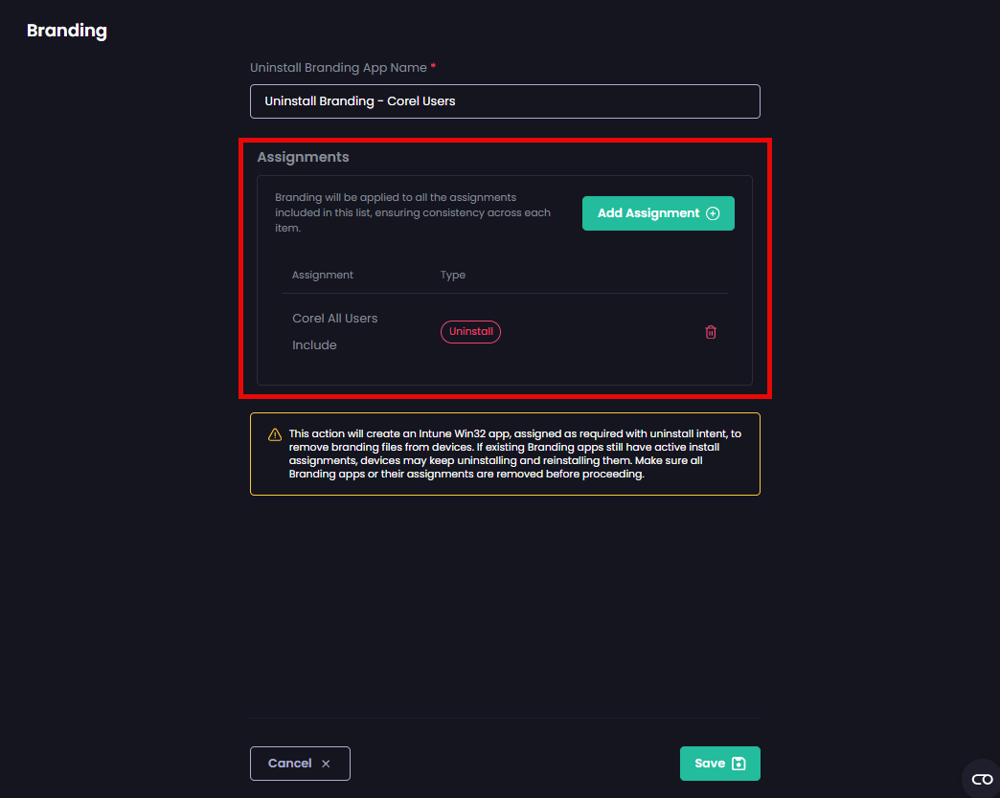

# Uninstall Branding in Patch My PC Cloud

_Applies to: Patch My PC Cloud_

To uninstall any custom logos or localizations from your end-user devices installed by a Patch My PC (PMPC) Cloud branding app, you need to uninstall the relevant branding app.

Simply [deleting a branding app](delete-branding.md) only removes that branding app from Intune.

Creating an **Uninstall Branding App** creates a Win32 app in Intune with a **Required** assignment with an uninstall intent, which will remove any PMPC Cloud custom branding files from the assigned devices.


**Important**

Each device can only have one branding app installed. Even if you have multiple branding apps assigned to the same device, only the one that was installed last will be installed on the device.

The script that the Uninstall branding app runs removes the branding currently installed on the device. It does not check which specific branding was originally deployed.

For example, if you assign the uninstall for Branding A, but the device now has Branding B, Branding B will be removed.

This is why, when you create an Uninstall branding app, a new Win32 app is created that will uninstall any branding app the targeted device may have installed.


To uninstall a branding app:

1. Navigate to **Settings | Branding**

<figure><figcaption></figcaption></figure>

2.  On the **Branding** screen, make a note of the assignments for the branding app you want to uninstall. 

    For example, if you plan to uninstall the **Branding – Corel Users** branding app, make a note of which resources it is assigned to by hovering over **Assignments** and noting the assignments (**Corel All Users** in this example).

<figure><figcaption></figcaption></figure>

3.  Follow [Delete Cloud Branding](delete-branding.md) to delete the branding app that is to be uninstalled. 

    This not only deletes the branding app from Intune, but also avoids a potential loop of the branding being installed by the branding app and then uninstalled by the branding uninstall app.
4. On the **Branding** screen, click **Uninstall Brandings**

<figure><figcaption></figcaption></figure>

5. In the **Uninstall Branding App Name** field, type a unique name for the Intune Win32 app that will be used to uninstall the branding app.

<figure><figcaption></figcaption></figure>

6. Click **Add Assignment**

<figure><figcaption></figcaption></figure>

7. On the **Add Uninstall Assignment** page, select the relevant resources noted in step 2 that this uninstall should be targeted to and click **Save**.

<figure><figcaption></figcaption></figure>

The list of assignments is updated to show that the **Uninstall** assignment has been added for the selected resources.


**Important**

Assigning the Uninstall Branding App to a resource will remove all PMPC Cloud-related brandings, associated files, and localizations.


<figure><figcaption></figcaption></figure>

8. If the list of assignments is correct, proceed to step 9; otherwise, repeat steps 6 and 7 to add any additional assignments.


**Tip**

You can delete an assignment by clicking the trash can beside it.


9. Click **Save** to continue.

<figure><figcaption></figcaption></figure>

The **Branding** page is redisplayed, showing the new **Uninstall App** at the top, along with the **Success – Uninstall Branding app created** notification.


**Tip**

You can tell which Branding App is the uninstall as it has **UNINSTALL BRANDING** for its company logo.


<figure><figcaption></figcaption></figure>


**Note**

You can only create one branding uninstall app, which, like other apps, can be edited, recreated, and deleted. If you need to uninstall branding from different resources, you will need to:

1. Edit the existing branding uninstall app by clicking on the ellipsis (**⋮**) beside it and selecting **Edit**.
2. Changing the name of the uninstall branding app as required.
3. Amend the assignments to the corresponding resources you wish to remove branding from.
4. Save your changes.

Also, when deploying a new branding app, if you already have an uninstall app, check to ensure the uninstall app is not assigned to the same resources as the branding app, otherwise, you could encounter an unwanted loop with the branding app being installed, but then uninstalled by the uninstall branding app.

