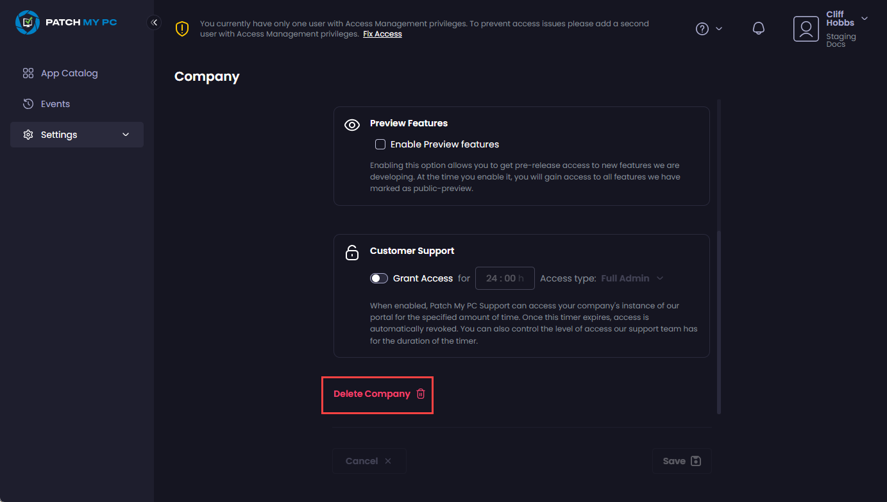
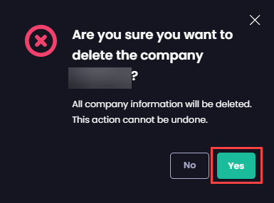

# Delete your Patch My PC Cloud Company

_Applies to: Patch My PC Cloud_

If you've completed your trial of Patch My PC (PMPC) Cloud and decided it's not for you or you just want to remove PMPC Cloud from your environment, you need to delete your company.


**Note**

Before you can delete your company, you must use the:

* [Disconnect Publisher](../connections/disconnect-connection.md#disconnect-publisher) process to disconnect any Publisher connections.
* [Disconnect Intune](../connections/disconnect-connection.md#disconnect-intune) process to disconnect Intune.

If the portal detects any connections, the **Delete Company** button will be unavailable.


To delete your company from Patch My PC (PMPC) Cloud:

1.  Navigate to **Settings | Company**. 

    <figure><figcaption></figcaption></figure>
2.  Scroll down to the bottom of the **Company** page and click **Delete Company**. 

    <figure><figcaption></figcaption></figure>
3.  On the **Are you sure you want to delete the company <**_**company\_name**_**>?** dialog box, click **Yes** to confirm the deletion. 

    <figure>?” dialog box" width="289"><figcaption></figcaption></figure>

    \
    The Patch My PC Signup screen is displayed. 

    <figure><figcaption></figcaption></figure>
4. Follow the [Deleting the Patch My PC Cloud Enterprise Application](../../delete-enterprise-app.md) process to delete the PMPC Enterprise Application and complete the deletion of your company.
