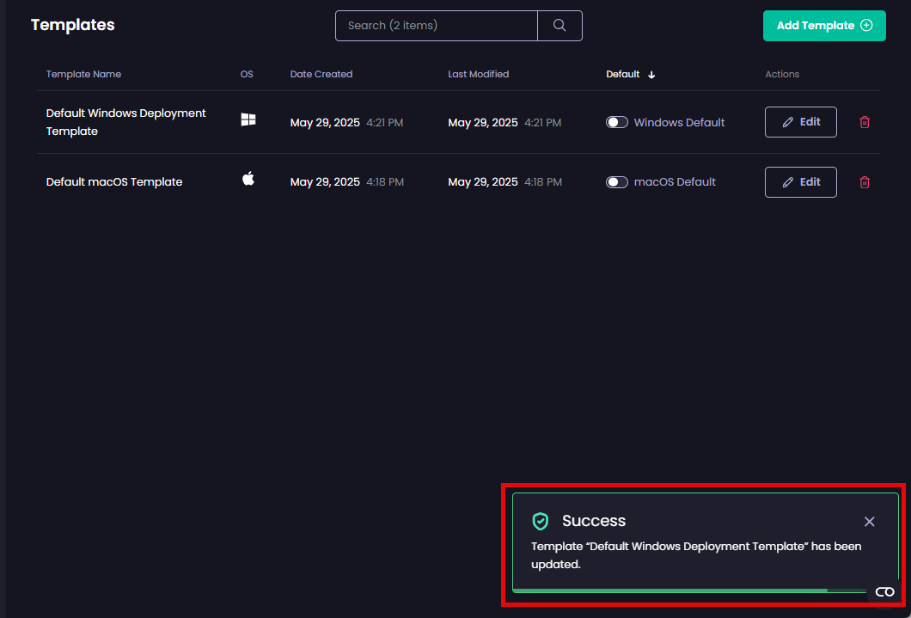

# Edit a Deployment Template in Patch My PC Cloud

_Applies to: Patch My PC Cloud_

To edit an existing Deployment Template in Patch My PC (PMPC) Cloud:

1. Navigate to **Settings | Templates**

<figure><figcaption></figcaption></figure>

2. On the **Templates** page, click **Edit** beside the relevant template.

<figure><figcaption></figcaption></figure>

3. Make the required changes, then click **Save** to save them.

<figure><figcaption></figcaption></figure>

The **Templates** page is redisplayed along with the **Success - Template “<**_**template\_name**_**>" has been updated** notification.

<figure><figcaption></figcaption></figure>


**Note**

Editing and saving an existing template does not affect any current or previous deployments created based on that template. Only new deployments created after the template is edited will use the new settings if configured to use them.

