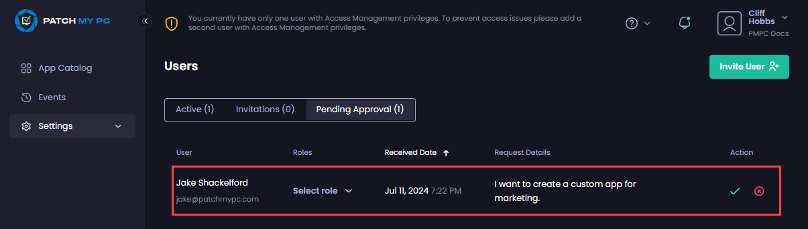

# Manage Access Requests in Patch My PC Cloud

_Applies to: Patch My PC Cloud_

Access to the Patch My PC (PMPC) Cloud portal is controlled through either an access request initiated by a user or an invitation initiated by an existing administrative user.

This section details how to manage Access Requests.


**Note**

See [Managing Invitations](../invitations/) for more information on invitations.


There are two ways to manage Access Requests to join your PMPC Cloud portal:

* Clicking **Review Request** in the email generated when the user requests access.
* Navigating to **Settings | Users | Pending Approval**.


**Note**

Clicking **Review Request** in the email takes you to the **Pending Approval** page. To see an example of the access request email, see [Example Access Request email](../../../../technical-references/cloud-email-reference/example-cloud-access-request-email.md).


<figure><figcaption></figcaption></figure>

Any pending approvals are shown.

<figure><figcaption></figcaption></figure>

From this screen, you can:

* [Approve an Access Request](approve-access-request.md)
* [Reject an Access Request](reject-access-request.md)
