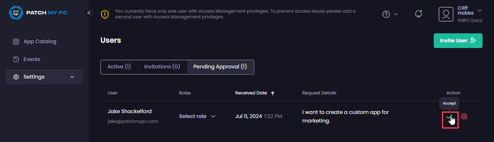
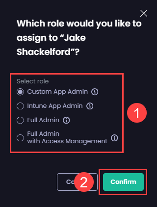
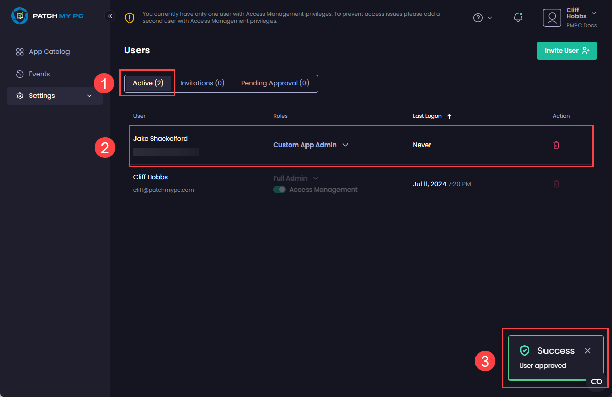

# Approve an Access Request in Patch My PC Cloud

_Applies to: Patch My PC Cloud_

To accept a user’s access request in Patch My PC (PMPC) Cloud:

1.  Click the green tick in the **Action** column. 

    <figure><figcaption></figcaption></figure>
2.  On the **Which role would you like to assign to “<**_**user\_name**_**>”** dialog box, select the relevant role to assign this user, then click **Confirm**. 

    <figure><figcaption></figcaption></figure>


**Tip**

Hover over the “**i**” beside each role to see more information, or see [User Roles](../user-roles-reference.md) for more information.


The portal auto-refreshes and switches to the **Active** tab to show the user has been added. At the same time, the **User approved** notification is shown.

<figure><figcaption></figcaption></figure>

The user will receive an email from the [noreply@patchmypc.com](mailto:noreply@patchmypc.com) mailbox with the subject **Access Granted “<**_**company\_name**_**>”**.


**Note**

See [Example Access Approved Email](../../../../technical-references/cloud-email-reference/example-cloud-access-approved-email.md) for an example of the email.

