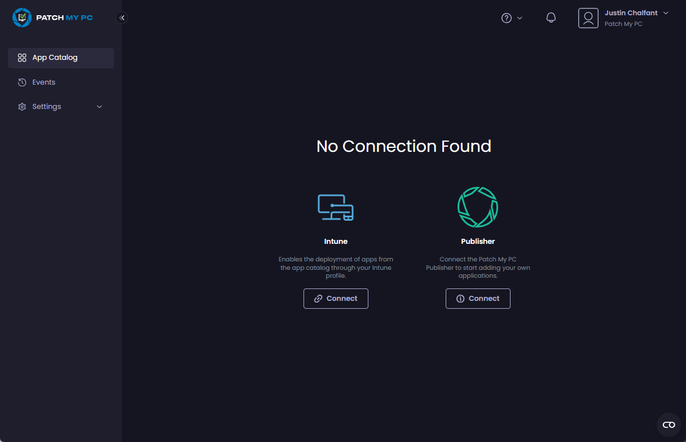

# Accept an Invitation in Patch My PC Cloud

_Applies to: Patch My PC Cloud_

This article details how users receiving an invitation should action it to access their company’s Patch My PC (PMPC) Cloud portal.


**Tip**

Send the link to these instructions to any users invited to your PMPC Cloud portal to help them onboard.


To accept your invitation to join your company on PMPC Cloud:

1. Locate your invitation email titled **You have been invited** and click **Join Now**.


**Note**

See [Example Invitation email](../../../../technical-references/cloud-email-reference/example-cloud-invitation-email.md) to see an example of the email.


2.  On the **User info** screen of the onboarding wizard, verify your name. 

    <figure><figcaption></figcaption></figure>
3.  Click the **Terms and Conditions** link to see these for using PMPC software and services. 

    <figure><figcaption></figcaption></figure>

    \
    The **Terms and Conditions** page is displayed. Once you’ve reviewed them, click the **X** in the top right-hand corner to close this window. 

    <figure><figcaption></figcaption></figure>
4.  If you agree with our terms and conditions, check the **Accept all Terms and Conditions** checkbox. 

    <figure><figcaption></figcaption></figure>


**Note**

You cannot proceed with the onboarding without checking this checkbox.


5.  Click **Continue** 

    <figure><figcaption></figcaption></figure>

    \
    The PMPC Cloud portal loads, showing the **App Catalog** page. 

    <figure><figcaption></figcaption></figure>
