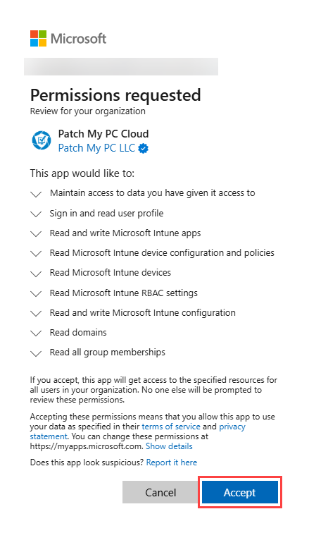

# Permissions required for Intune Apps

_Applies to: Patch My PC Cloud_

In addition to the [Permissions required for Patch My PC Cloud](permissions-required-for-patch-my-pc-cloud.md), we also require the following permissions to onboard to Intune Apps for Cloud (Intune Apps) and access your company data:

* [Read all group memberships](permissions-required-for-intune-apps.md#read-all-group-memberships)
* [Read all users’ full profile](permissions-required-for-intune-apps.md#read-all-users-full-profile)
* [Read and write Microsoft Intune apps](permissions-required-for-intune-apps.md#read-and-write-microsoft-intune-apps)
* [Read and write Microsoft Intune configuration](permissions-required-for-intune-apps.md#read-and-write-microsoft-intune-configuration)
* [Read domains](permissions-required-for-intune-apps.md#read-domains)
* [Read Microsoft Intune device configuration and policies](permissions-required-for-intune-apps.md#read-microsoft-intune-device-configuration-and-policies)
* [Read Microsoft Intune devices](permissions-required-for-intune-apps.md#read-microsoft-intune-devices)
* [Read Microsoft Intune RBAC settings](permissions-required-for-intune-apps.md#read-microsoft-intune-rbac-settings)


**Note**

To connect with Intune, the signed-in user must have the **Cloud Application Administrator** or **Application Administrator** role to allow creation of the Enterprise app, and the **Privileged Role Administrator** role to approve the Graph API permissions we require. A **Global Administrator** can also perform both steps. The exact permission actions required are `microsoft.directory/servicePrincipals/create` and `microsoft.directory/servicePrincipals/managePermissionGrantsForAll.microsoft-company-admin`.

\
You can read more about Entra ID roles at [Microsoft Entra built-in roles](https://learn.microsoft.com/en-us/entra/identity/role-based-access-control/permissions-reference).


## Read all group memberships

<table data-header-hidden><thead><tr><th width="156" valign="top"></th><th valign="top"></th></tr></thead><tbody><tr><td valign="top">Claim</td><td valign="top">GroupMember.Read.All</td></tr><tr><td valign="top">Description</td><td valign="top">Allows the app to read memberships and basic group properties for all groups without a signed-in user.</td></tr><tr><td valign="top">Permission Type</td><td valign="top">Application</td></tr><tr><td valign="top">Impact if revoked</td><td valign="top"><ul><li>Groups cannot be added through <strong>Settings | Users</strong></li><li>You will be unable to create new Deployments or manage existing ones.</li><li>The Migration feature is unavailable.</li><li>Discovery data is not collected.</li><li>If revoked at a Child MSP Company, that company cannot be added to an App Set at the Parent Company.</li><li>You will see the <strong>Permissions Issue Detected</strong> warning on the Entra ID Groups tab under <strong>Settings | Users</strong></li></ul></td></tr></tbody></table>

## Read all users’ full profile

<table data-header-hidden><thead><tr><th width="156" valign="top"></th><th valign="top"></th></tr></thead><tbody><tr><td valign="top">Claim</td><td valign="top">User.Read.All</td></tr><tr><td valign="top">Description</td><td valign="top">Allows the app to read user profiles without a signed in user.</td></tr><tr><td valign="top">Permission Type</td><td valign="top">Application</td></tr><tr><td valign="top">Impact if revoked</td><td valign="top">Will display at zero, rather than retrieving the number of users shown on the MSP Customers page.</td></tr></tbody></table>

## Read and write Microsoft Intune apps

<table data-header-hidden><thead><tr><th width="156" valign="top"></th><th valign="top"></th></tr></thead><tbody><tr><td valign="top">Claim</td><td valign="top">DeviceManagementApps.ReadWrite.All</td></tr><tr><td valign="top">Description</td><td valign="top">Allows the app to read and write the properties, group assignments and status of apps, app configurations and app protection policies managed by Microsoft Intune, without a user being signed-in.</td></tr><tr><td valign="top">Permission Type</td><td valign="top">Application</td></tr><tr><td valign="top">Impact if revoked</td><td valign="top"><ul><li>Groups cannot be added through <strong>Settings | Users</strong>.</li><li>You will be unable to create new Deployments or edit existing ones.</li><li>The Migration feature is unavailable.</li><li>Discovery data is not collected.</li><li>If revoked at a Child MSP Company, that company cannot be added to an App Set at the Parent Company. When editing an App Set that contains the affected Child Company, an error appears stating you need to remove the Child Company from the App Set to save your changes. App Sets affected by this issue will also be excluded from the Sync Schedule.</li></ul></td></tr></tbody></table>

## Read and write Microsoft Intune configuration

<table data-header-hidden><thead><tr><th width="156" valign="top"></th><th valign="top"></th></tr></thead><tbody><tr><td valign="top">Claim</td><td valign="top">DeviceManagementServiceConfig.ReadWrite.All</td></tr><tr><td valign="top">Description</td><td valign="top">Allows the app to read and write Microsoft Intune service properties including device enrollment and third party service connection configuration, without a signed-in user.</td></tr><tr><td valign="top">Permission Type</td><td valign="top">Application</td></tr><tr><td valign="top">Impact if revoked</td><td valign="top"><ul><li>Deployments will fail to auto-create during a Sync Schedule. You will need to click <strong>Recreate</strong> manually each time to recreate the affected deployments.</li><li>Deployments can still be created, but <strong>ESP Profiles</strong> will be unavailable as detailed by the tooltip.</li><li>Existing deployments containing <strong>ESP Profiles</strong> will show an error when on the <strong>Configurations</strong> tab, under the <strong>ESP Profiles</strong> section, and you will be unable to save your changes without deleting the ESP Profiles.</li></ul></td></tr></tbody></table>


**Note**

This permission is required to manage blocking apps in the Enrollment Status Page (ESP) profile directly from the PMPC Cloud Portal. This is the only feature in our solution that relies on this permission.

We understand this permission may seem broad, but Microsoft does not offer a more granular alternative for updating the blocking apps feature in ESP profiles.

If you have concerns and choose to revoke this permission from the **Patch My PC Cloud** Enterprise App in your Entra ID tenant, please be aware that this will impair our ability to update deployments.

See [DeviceManagementServiceConfig.ReadWrite.All | Graph Permissions](https://graphpermissions.merill.net/permission/DeviceManagementServiceConfig.ReadWrite.All?tabs=apiv1%2CdeviceManagement1) for more details on the Graph endpoints covered by this API permission.


## Read domains

<table data-header-hidden><thead><tr><th width="156" valign="top"></th><th valign="top"></th></tr></thead><tbody><tr><td valign="top">Claim</td><td valign="top">Domain.Read.All</td></tr><tr><td valign="top">Description</td><td valign="top">Allows the app to read all domain properties without a signed-in user.</td></tr><tr><td valign="top">Permission Type</td><td valign="top">Application</td></tr><tr><td valign="top">Impact if revoked</td><td valign="top">When you navigate to <strong>Settings | Company</strong> and click on the <strong>Domains</strong> tab, the <strong>Permissions Issue Detected</strong> message appears, giving you the option to <a href="../../manage/settings/connections/reconnect-connection.md">Reconnect to Intune</a>.</td></tr></tbody></table>

## Read Microsoft Intune device configuration and policies

<table data-header-hidden><thead><tr><th width="156" valign="top"></th><th valign="top"></th></tr></thead><tbody><tr><td valign="top">Claim</td><td valign="top">DeviceManagementConfiguration.Read.All</td></tr><tr><td valign="top">Description</td><td valign="top">Allows the app to read properties of Microsoft Intune-managed device configuration and device compliance policies and their assignments to groups, without a signed-in user.</td></tr><tr><td valign="top">Permission Type</td><td valign="top">Application</td></tr><tr><td valign="top">Impact if revoked</td><td valign="top"><ul><li>You will be unable to create new Deployments or edit existing ones.</li><li>The Migration feature is unavailable.</li><li>Discovery data is not collected.</li><li>If revoked at a Child MSP Company, that company cannot be added to an App Set at the Parent Company. Also, when editing an App Set that contains the affected Child Company, an error appears stating that you need to remove the Child Company from the App Set to save any changes.</li></ul></td></tr></tbody></table>

## Read Microsoft Intune devices

<table data-header-hidden><thead><tr><th width="156" valign="top"></th><th valign="top"></th></tr></thead><tbody><tr><td valign="top">Claim</td><td valign="top">DeviceManagementManagedDevices.Read.All</td></tr><tr><td valign="top">Description</td><td valign="top">Allows the app to read the properties of devices managed by Microsoft Intune, without a signed-in user.</td></tr><tr><td valign="top">Permission Type</td><td valign="top">Application</td></tr><tr><td valign="top">Impact if revoked</td><td valign="top"><ul><li>The number of devices on the <strong>Usage</strong> tab shows as <strong>N/A</strong>.</li><li>Groups cannot be added through <strong>Settings | Users</strong>.</li><li>You will be unable to create new Deployments or edit existing ones.</li><li>The Migration feature is unavailable.</li><li>Discovery data is not collected.</li><li>For MSP Parent companies, the number of devices will be missing on the companies' list for the Child companies for whom the permission is missing.</li><li>If revoked at a Child MSP Company, that company cannot be added to an App Set at the Parent Company.</li></ul></td></tr></tbody></table>

## Read Microsoft Intune RBAC settings

<table data-header-hidden><thead><tr><th width="156" valign="top"></th><th valign="top"></th></tr></thead><tbody><tr><td valign="top">Claim</td><td valign="top">DeviceManagementRBAC.Read.All</td></tr><tr><td valign="top">Description</td><td valign="top">Allows the app to read the properties relating to the Microsoft Intune Role-Based Access Control (RBAC) settings, without a signed-in user.</td></tr><tr><td valign="top">Permission Type</td><td valign="top">Application</td></tr><tr><td valign="top">Impact if revoked</td><td valign="top"><ul><li>Deployments can still be created, but <strong>Role Scope Tags</strong> will be unavailable as detailed by the tooltip.</li><li>Existing deployments containing <strong>Role Scope Tags</strong> will show an error when edited. You will need to either cancel your edit and fix the permission issue before you can edit the deployment or remove the Role Scope Tags to save your changes.</li></ul></td></tr></tbody></table>

As per the **Permissions requested** dialog box displayed when you connect your Intune tenant:

“_If you accept, this app will get access to the specified resources for all users in your organization. No one else will be prompted to review these permissions._

_Accepting these permissions means that you allow this app to use your data as specified in their_ [_terms of service_](https://patchmypc.com/terms-of-service) _and_ [_privacy statement_](https://patchmypc.com/privacy-policy)_. You can change these permissions at_ [_https://myapps.microsoft.com_](https://myapps.microsoft.com)_._ [_Show details_](https://login.microsoftonline.com/common/reprocess?ctx=rQQIARAA42JQYLRSSTE3N7BITU7WNUo0SNM1MTc31k00tkjUTUsztDQ3NDNOM01LLRLiEri8dA_nLP5fHi0Oe3K7bpx8tYrRKKOkpKDYSl-_IL-oJDFHryCxJDkjt7IgWS85P1e_OLWkJDMvvVg_Na8ssyg_Lzc1r6T4AiPjC0bGW0w8jim5mXnO-XnFQNFXTLyJIG58MoQ_i9miWglJl2eKkpVSslGyWZqlcZKuoWGyua5JqpGBblKaYYquqYVpqqWBBRCYJirVbmJmA9qdm593gUX4FQuPAbMVBweXAIMEgwLDDxbGRaxAf5Sp6_QtkzrrNj_5Re4KZ1aGU6z6hf6FRuWGxRU-eRkGiaHeQS5m5p7-lRaF2hm5Zcbexpm-qckBQf5Z_n5R-baGVoYT2BROsTF8YGPsYGeYxc6wi5OMgDjAy_CDr_Hs17M9S2a983jFrxPmVmZZ7u_ikhxqku4Vme6ZmuwcYuDv4mxZZGRqVBmQbBKRWZ4TYWDgkmdiu0GAAQA1\&sessionid=766d5a9d-ac0f-4a78-884c-f30290b1c9a8)

_Does this app look suspicious?_ [_Report it here_](https://login.microsoftonline.com/common/reprocess?ctx=rQQIARAA42JQYLRSSTE3N7BITU7WNUo0SNM1MTc31k00tkjUTUsztDQ3NDNOM01LLRLiEri8dA_nLP5fHi0Oe3K7bpx8tYrRKKOkpKDYSl-_IL-oJDFHryCxJDkjt7IgWS85P1e_OLWkJDMvvVg_Na8ssyg_Lzc1r6T4AiPjC0bGW0w8jim5mXnO-XnFQNFXTLyJIG58MoQ_i9miWglJl2eKkpVSslGyWZqlcZKuoWGyua5JqpGBblKaYYquqYVpqqWBBRCYJirVbmJmA9qdm593gUX4FQuPAbMVBweXAIMEgwLDDxbGRaxAf5Sp6_QtkzrrNj_5Re4KZ1aGU6z6hf6FRuWGxRU-eRkGiaHeQS5m5p7-lRaF2hm5Zcbexpm-qckBQf5Z_n5R-baGVoYT2BROsTF8YGPsYGeYxc6wi5OMgDjAy_CDr_Hs17M9S2a983jFrxPmVmZZ7u_ikhxqku4Vme6ZmuwcYuDv4mxZZGRqVBmQbBKRWZ4TYWDgkmdiu0GAAQA1\&sessionid=766d5a9d-ac0f-4a78-884c-f30290b1c9a8)_.”_

You will be prompted to grant these during whenever you connect an Intune Tenant to your PMPC Cloud Portal by clicking **Accept** on the **Permissions requested** dialog box.

<figure><figcaption></figcaption></figure>
