# Create an App Registration in Entra ID

_Applies to: Patch My PC Cloud_

There may be some scenarios (such as [Recover Your Company](../../manage/settings/company-settings/recover-company.md) ) where you need to create an App Registration in Entra ID for use with Patch My PC (PMPC) Cloud.


**Important**

Once you create an App Registration, it must be used within 72 hours; otherwise, it will be considered expired, and you will need to create a new one.


We use this process to verify you are an Application Administrator or a higher privilege user (such as a Global Admin), in the same Entra ID tenant as the PMPC Company being managed.

To create an App Registration:

1. Sign in to the Microsoft Azure portal using an account with the Global Admin role and navigate to the [App Registrations](https://portal.azure.com/#view/Microsoft_AAD_RegisteredApps/ApplicationsListBlade) blade.


**Important**

You must use an account in the same Microsoft 365 subscription (tenant) as your PMPC Company.


<figure>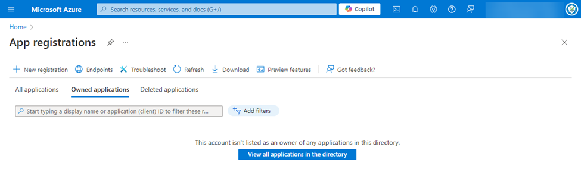<figcaption></figcaption></figure>

2. Click **New registration**.

<figure><figcaption></figcaption></figure>

3. In the **Name** field, enter **PMPC Recovery**, then click **Register**.

<figure><figcaption></figcaption></figure>

4. Make a note of the following values:
   1. **Application (client) ID**
   2. **Object ID**
   3. **Directory (tenant) ID**

<figure>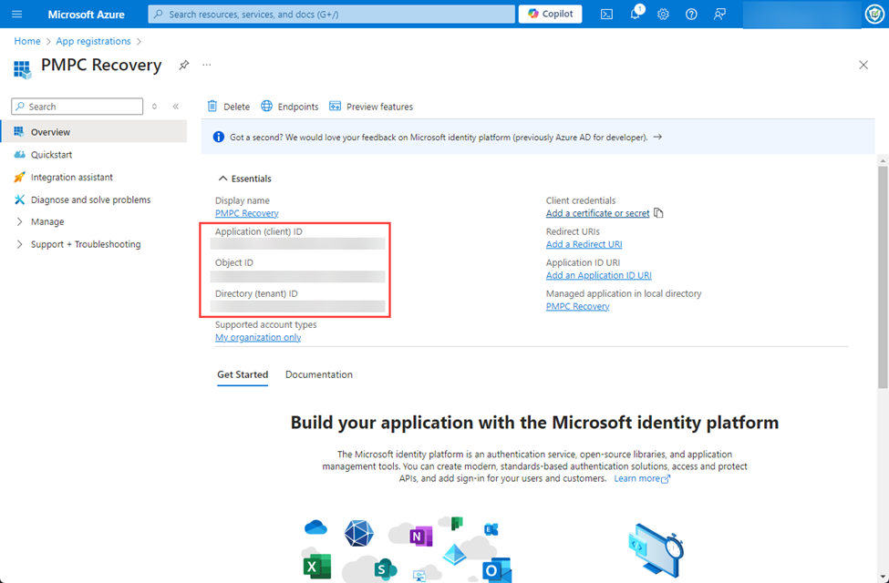<figcaption></figcaption></figure>

5. Navigate to **Manage | API Permissions**.

<figure>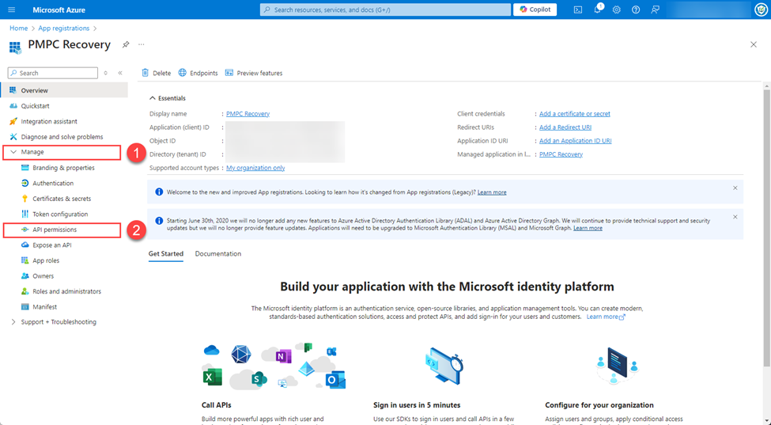<figcaption></figcaption></figure>

6. Under the **Configured permissions** section, click **Add a permission**.

<figure>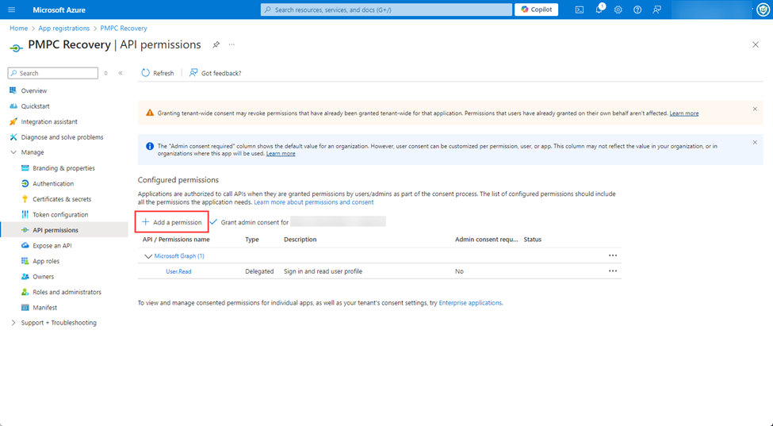<figcaption></figcaption></figure>

7. In the **Request API permissions** blade, click **Microsoft Graph**.

<figure>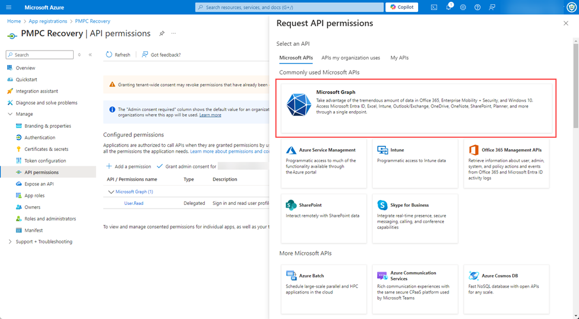<figcaption></figcaption></figure>

8. In the **Request API permissions** blade, click **Application permissions**.

<figure>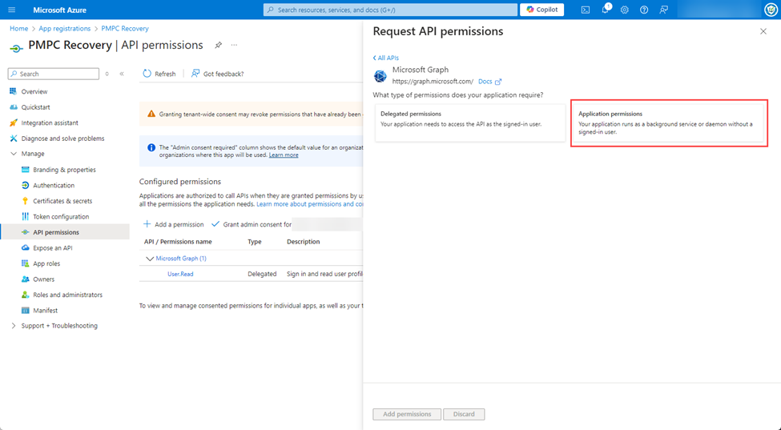<figcaption></figcaption></figure>

9. In the **Select permissions** field, type **AuditLog**, then expand this section and check the **AuditLog.Read.All** permission checkbox.

<figure>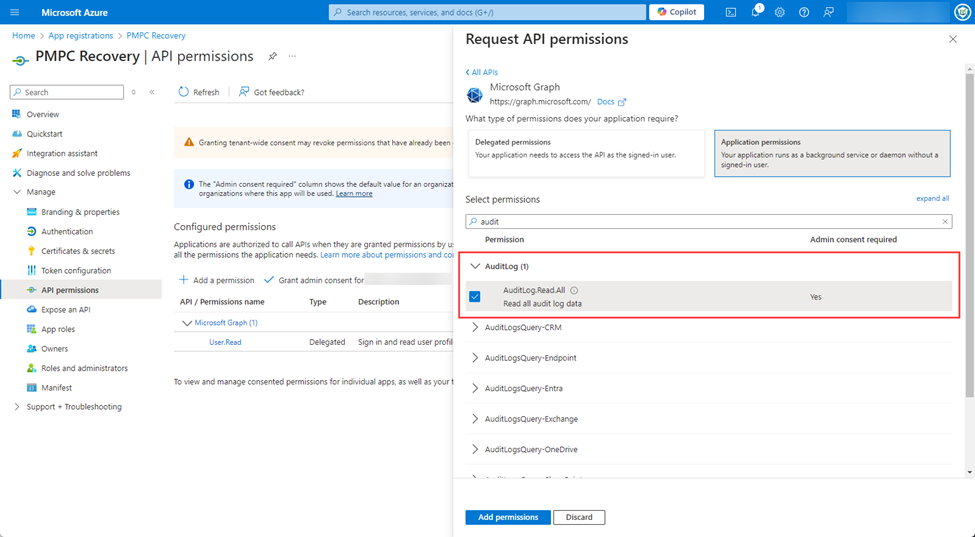<figcaption></figcaption></figure>

10. Click **Add permissions**.

<figure>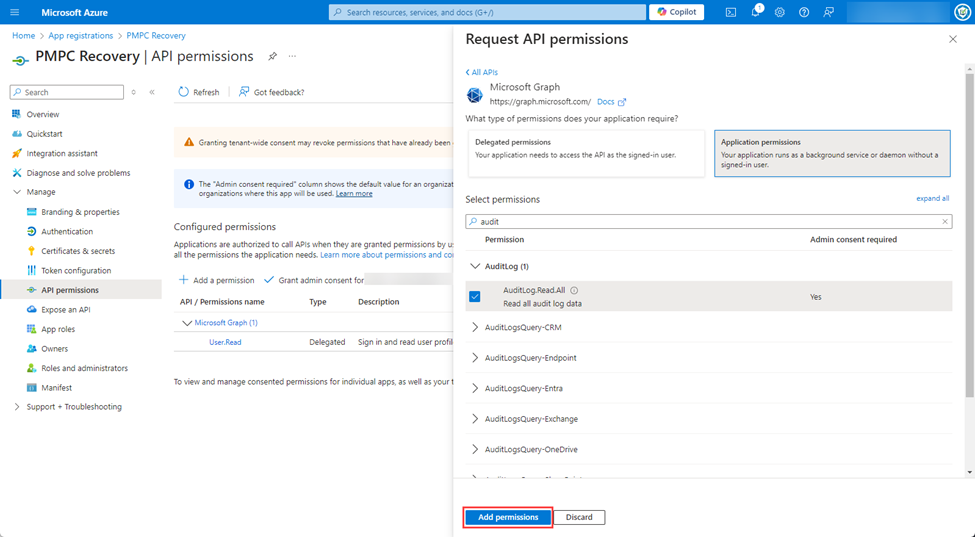<figcaption></figcaption></figure>

11. On the **API permissions** screen, under the **Configured permissions** section, click **Grant admin consent for <**_**your\_tenant\_name**_**>**.

<figure>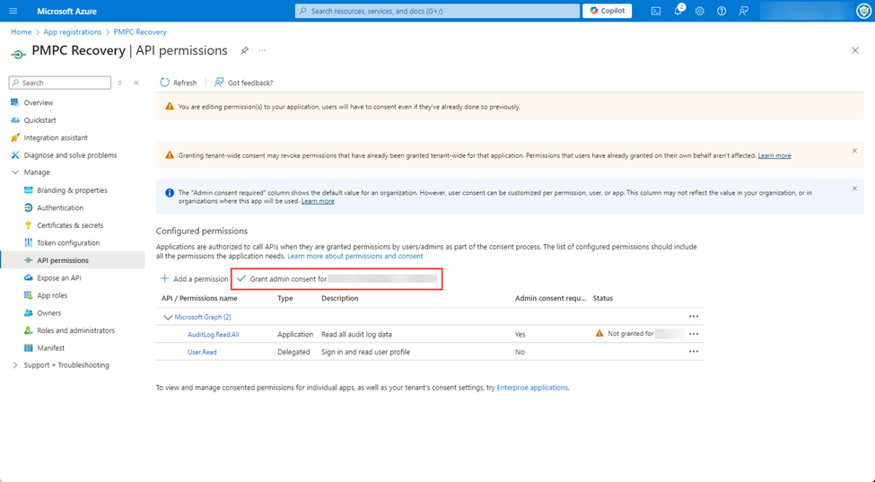&#x27;" width="563"><figcaption></figcaption></figure>

12. On the **Grant admin consent confirmation** popup, click **Yes**.

<figure>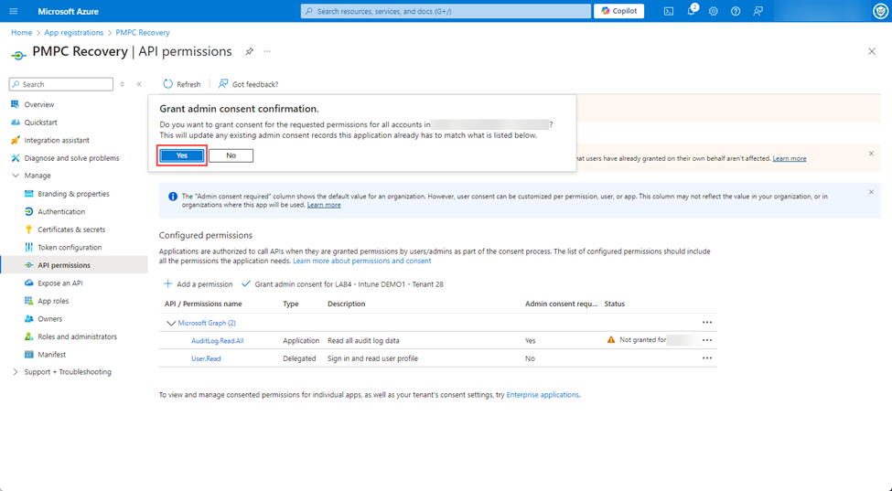<figcaption></figcaption></figure>

The **Grant consent - Grant consent successful** notification is shown and the **Status** for the **AuditLog.Read.All** permission changes to a green tick.

<figure>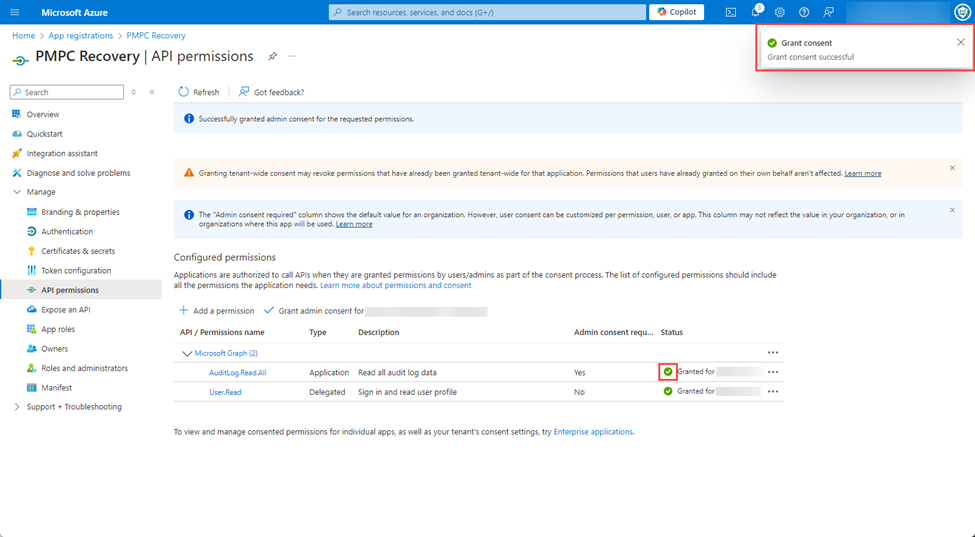<figcaption></figcaption></figure>

13. Navigate to **Certificates and secrets**.

<figure><figcaption></figcaption></figure>

14. Under the **Client secrets** section, click **New client secret**.

<figure><figcaption></figcaption></figure>

15. In the **Add a client secret** panel, type **PMPC Recovery**, then click **Add**.

<figure><figcaption></figcaption></figure>

The new Client Secret appears along with the **Update application credentials - Successfully updated application PMPC Recovery credentials** notification.

<figure><figcaption></figcaption></figure>

16. Make a note of the **Value** of the **PMPC Recovery** client secret.
