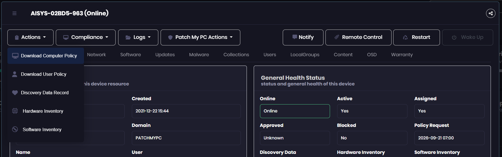
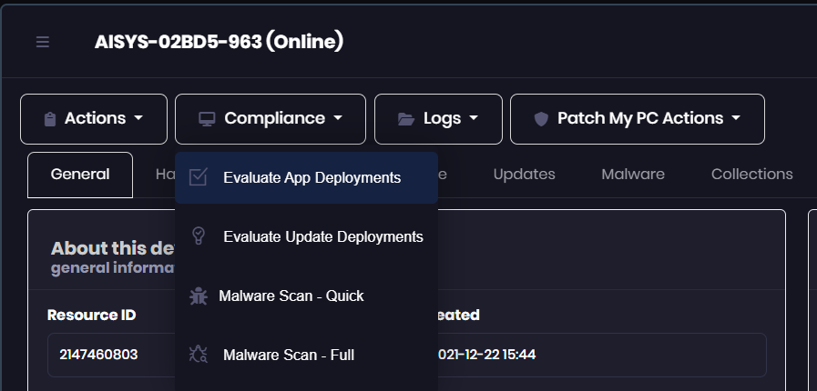
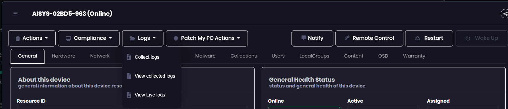
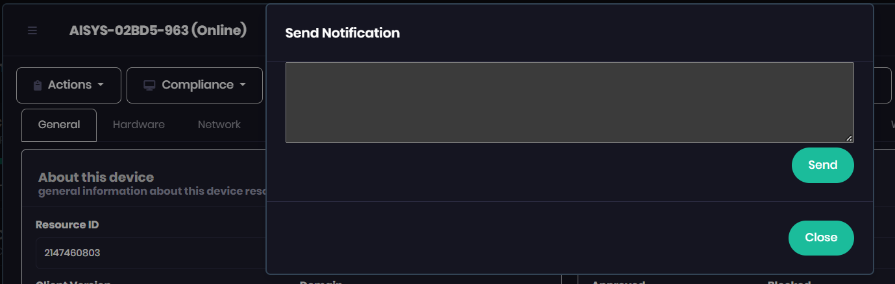
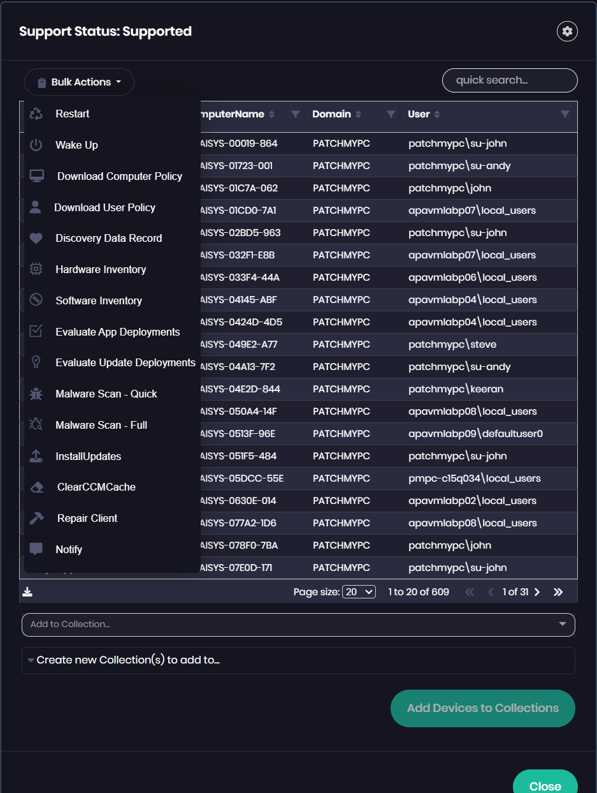

# Device Actions in Advanced Insights

_Applies to: Patch My PC Advanced Insights for Configuration Manager_

Advanced Insights lets you run a range of client actions directly against your managed devices, without opening the Configuration Manager console. Actions are available in two places:

* **Device Details view** – the toolbar at the top of a single device's detail page (the "device modal").
* **Bulk Actions** – the same actions applied to many devices at once from any device table.

Actions fall into two groups:

* **Standard ConfigMgr actions** – Advanced Insights triggers the built-in Configuration Manager client notification directly through the SMS Provider. These behave exactly as the equivalent right‑click action in the ConfigMgr console.
* **Custom client actions** – provided by the **Advanced Insights Inventory Extensions**. These require the Inventory Extensions MSI to be installed on the client and are described in more detail below.


**Permissions**

Advanced Insights must be granted the correct permissions to your SMS Provider for these actions to work. See Insights Configuration Manager Permission requirements.


***

### Device Details toolbar

The toolbar at the top of the Device Details view groups the available actions into menus and buttons.

<figure><figcaption></figcaption></figure>

Buttons and menus are enabled based on the device's state — for example, **Wake Up** is only available when the device is offline and Wake‑on‑LAN is configured, and **Remote Control** requires the Remote Control prerequisites.

#### Actions menu (standard)

Triggers the standard Configuration Manager client notification for common client cycles.

| Action                       | Description                                                                                                      |
| ---------------------------- | ---------------------------------------------------------------------------------------------------------------- |
| **Download Computer Policy** | Triggers the **Machine Policy Retrieval & Evaluation Cycle** so the device picks up new machine‑targeted policy. |
| **Download User Policy**     | Triggers the **User Policy Retrieval & Evaluation Cycle** for the logged‑on user.                                |
| **Discovery Data Record**    | Sends a new **Heartbeat Discovery** Data Discovery Record (DDR) to update the device's discovery data.           |
| **Hardware Inventory**       | Triggers the **Hardware Inventory Cycle**, including the custom Advanced Insights inventory classes.             |
| **Software Inventory**       | Triggers the **Software Inventory Cycle**.                                                                       |

#### Compliance menu (standard)

<figure><figcaption></figcaption></figure>

| Action                          | Description                                                                                               |
| ------------------------------- | --------------------------------------------------------------------------------------------------------- |
| **Evaluate App Deployments**    | Triggers the **Application Deployment Evaluation Cycle** to re‑evaluate required application deployments. |
| **Evaluate Update Deployments** | Triggers the **Software Updates Deployment Evaluation Cycle** to re‑evaluate deployed updates.            |
| **Malware Scan – Quick**        | Starts a **Quick** Microsoft Defender / Endpoint Protection scan on the device.                           |
| **Malware Scan – Full**         | Starts a **Full** Microsoft Defender / Endpoint Protection scan on the device.                            |

#### Logs menu (standard)

<figure><figcaption></figcaption></figure>

| Action                  | Description                                                                                                                                   |
| ----------------------- | --------------------------------------------------------------------------------------------------------------------------------------------- |
| **Collect logs**        | Triggers the Configuration Manager **Client Diagnostics – Collect Client Logs** notification, which uploads the client log files to the site. |
| **View collected logs** | Opens the logs that were previously uploaded by a **Collect logs** action for review.                                                         |
| **View Live logs**      | Streams the client's logs so you can watch activity in near real time.                                                                        |

#### Restart, Wake Up and Remote Control (standard)

| Button             | Description                                                                                                                           |
| ------------------ | ------------------------------------------------------------------------------------------------------------------------------------- |
| **Restart**        | Sends a restart request to the device using the standard ConfigMgr client notification.                                               |
| **Wake Up**        | Sends a Wake‑on‑LAN packet to bring an offline device online. Only available when the device is offline and Wake‑on‑LAN is supported. |
| **Remote Control** | Launches a remote control session using the ConfigMgr Remote Tools. See Launching Remote Control of a Client from Advanced Insights.  |

***

### Custom client actions

The following actions are provided by the **Advanced Insights Inventory Extensions** and are only available on devices that have the Inventory Extensions MSI installed. They are also documented on the Insights Custom Client Actions page.


**Script Approval**

If your environment has the **Additional Script Approver** setting enabled in ConfigMgr, the first use of a custom client action may report that the script requires approval. Approve the **Advanced Insights Client Actions** script under **Software Library > Scripts** in the ConfigMgr console. See Insights Custom Client Actions for details.


#### Patch My PC Actions menu

<figure><figcaption></figcaption></figure>

| Action              | Description                                                                                                                                                                                                                 |
| ------------------- | --------------------------------------------------------------------------------------------------------------------------------------------------------------------------------------------------------------------------- |
| **Install Updates** | Installs every update that is advertised to the device as **available** or **required**. This is the equivalent of choosing **Install All** in Software Center. Progress is recorded in `UpdatesHandler.log` on the client. |
| **Clear CCM Cache** | Deletes all items from the Configuration Manager client cache (`ccmcache`), **including persistent cache items**, to reclaim disk space or force fresh content downloads.                                                   |
| **Repair Client**   | Runs the Configuration Manager client repair (`ccmrepair.exe`) to fix a damaged or misbehaving client. Progress is recorded in `CcmRepair.log` on the client.                                                               |

#### Notify

<figure><figcaption></figcaption></figure>

The **Notify** button sends a message to everyone currently logged on to the device.

1. Click **Notify** on the Device Details toolbar.
2. Type your message in the **Send Notification** dialog.
3. Click **Send**.

A branded message box (using your Software Center company name and logo) is displayed to **each** interactive user session on the device. Click **Close** to dismiss the dialog without sending.


If the device has no user logged on, there is no session to display the message in, so nothing is shown.


***

### Bulk Actions

Most device tables in Advanced Insights includes a **Bulk Actions** menu, letting you run the same actions against many devices in a single operation.

<figure><figcaption></figcaption></figure>

To run a bulk action:

1. Select the devices you want to target using the checkboxes in the table. Use **quick search** and the column filters to narrow the list first if needed.
2. Open the **Bulk Actions** menu and choose an action.
3. The action is queued against every selected device.

The Bulk Actions menu exposes the same standard and custom actions available in the Device Details view:

* **Standard ConfigMgr actions** – Restart, Wake Up, Download Computer Policy, Download User Policy, Discovery Data Record, Hardware Inventory, Software Inventory, Evaluate App Deployments, Evaluate Update Deployments, Malware Scan – Quick, Malware Scan – Full.
* **Custom client actions** – Install Updates, Clear CCM Cache, Repair Client and Notify. These only run on devices that have the Inventory Extensions MSI installed; other selected devices are skipped.


**Custom actions in bulk**

When you select **Notify** as a bulk action, you are prompted once for the message, which is then sent to all logged‑on users across every selected device.


#### Add devices to a Collection

The device table view also lets you add the selected devices to a ConfigMgr collection:

* **Add to Collection…** – choose one or more existing collections from the drop‑down.
* **Create new Collection(s) to add to…** – create one or more new collections to add the selected devices to.

Click **Add Devices to Collections** to apply your choice, then **Close** to return to the table.
