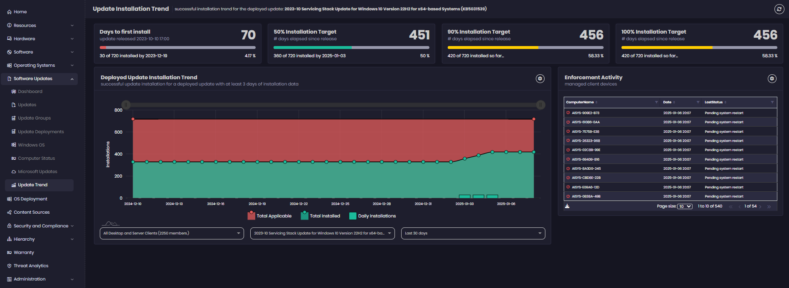

# Insights "Update Trend" Dashboard

_Applies to: Patch My PC Advanced Insights_

<figure><figcaption>
Update Installation Trend Dashboard
</figcaption></figure>


_For trend data to populate the deployments of your updates and ADR deployment must have the status messages set to at least "Success and Error"._


The Update Installation Trend dashboard shows the deployment trend of installation of a update.

The top row of shows how many days it took for the first device to install the update, 50%, 90% and 100% Installation targeted.

<figure><figcaption>
Deployment Update Installation Trend chart
</figcaption></figure>

You can filter the chart by collection, select which update and the number of days you want to see the trend for.


Some devices may become compliant without having installed this update via this deployment and these will not show in the installation data here.


<figure><figcaption>
Enforcement Activity chart
</figcaption></figure>

This portlet shows enforcement activity for managed client devices for this update.
