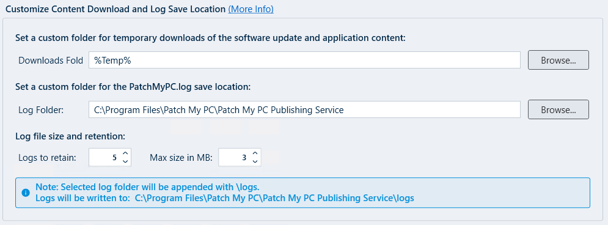

# Customize Content Download and Log Save Location section of Patch My PC Publisher

_Applies to: Patch My PC Publisher V3.x_

By default, Patch My PC (PMPC) Publisher downloads content and writes logs to locations derived from the system and installation context.

As Publisher runs under the **SYSTEM** account, default paths may not always align with organizational requirements for disk usage, monitoring, or security tooling.

The **Customize Content Download and Log Save Location** options allow you to override these defaults by specifying custom folders for:

* Temporary content downloads used during publishing
* The Publisher log folder


**Note**

These settings apply only to Publisher and do not affect client-side installations.


<figure><figcaption></figcaption></figure>

## Set a custom folder for temporary downloads of the software update and application content

By default, content files are downloaded temporarily to %TEMP% during publishing operations. Since the Publisher runs under the SYSTEM context, this typically resolves to:

```
C:\Windows\Temp
```

This screenshot shows the Publisher using `C:\Windows\Temp` as a temporary scratch location while preparing packages during a publishing sync.

<figure><figcaption></figcaption></figure>


**Note**

Temporary content downloaded to this location is automatically removed once publishing operations complete.


## Set a custom folder for the PatchMyPC.log save location

The Publisher writes service and operational logs to disk to support troubleshooting, auditing, and support diagnostics.

By default, Publisher logs are stored within the installation directory of the Patch My PC Publishing Service:

*   **Newer Publisher versions:**\
    Logs, including PatchMyPC.log, are stored in a dedicated **`Logs`** subfolder under the Publisher install directory.\
    Example:

    ```
    C:\Program Files\Patch My PC\Patch My PC Publishing Service\Logs
    ```
* **Older Publisher versions:**\
  The primary **PatchMyPC.log** file may still be located directly in the root of the Publishing Service installation directory rather than the `Logs` subfolder.

Because the Publisher runs under the SYSTEM account, the computer account of the server hosting the Publishing Service must have write permissions to the configured log folder. If permissions are insufficient, logging may fail.

## Log file size and retention

### &#x20;**Logs to retain**

The **Logs to retain** setting specifies how many log files to keep before older logs are overwritten.


**Note**

It is recommended to set **Logs to Retain** to **10**. Publisher log files are relatively small, and retaining additional history is extremely valuable when troubleshooting issues or providing support, as it preserves publishing context that may otherwise be lost.


### Max size in MB

The **Max size in MB** setting specifies the maximum size of each individual log file before a new log is created.


**Note**

It is recommended to set **Max size in MB** to **10**. Publisher log files are relatively small, and retaining additional history is extremely valuable when troubleshooting issues or providing support, as it preserves publishing context that may otherwise be lost.

